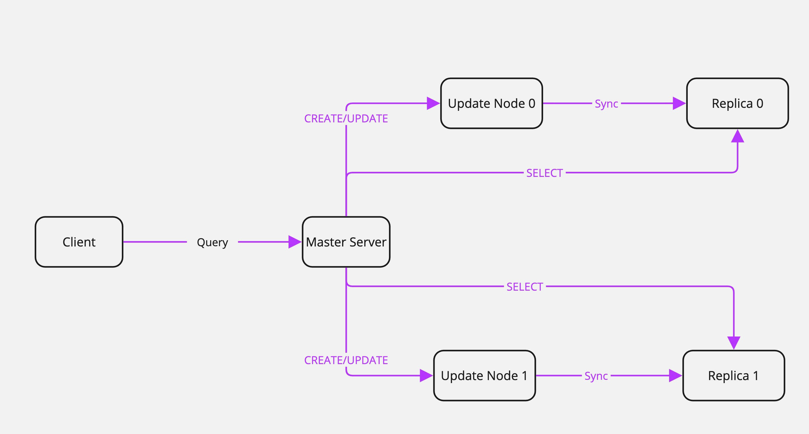

# Fault-Tolerant Distributed PostgreSQL System for AVNs

## Overview

This project implements a fault-tolerant distributed database system designed for **Autonomous Vehicle Networks (AVNs)**. It ensures reliable, scalable, and efficient data management in dynamic environments through advanced data sharding, fault-tolerance mechanisms, and containerized deployment.

### Key Features:

- **Data Sharding**: Reduces latency by storing data closer to the source.
- **Fault Tolerance**: Maintains operations during node failures using master-slave replication.
- **Efficient Query Processing**: Handles concurrent requests with non-blocking socket communication.
- **Scalability**: Enables rapid deployment and testing with Docker and CI/CD pipelines.

## Syetem Architecture


The project deploys six nodes:

1. `Client Node`: For sending queries.
2. `Master Node`: For query parsing and routing.
3. `Update Nodes (2)`: For handling CREATE and UPDATE operations.
4. `Replica Nodes (2)`: For handling SELECT operations and maintaining data consistency.

Refer to the project report for [detailed architecture](Distributed_Database_System.pdf)

## Environment Setup

### Prerequisites

1. Install Python 3.x
2. Install PostgreSQL: [Download PostgreSQL](https://www.postgresql.org/download/)
3. Install Docker and Git

### Virtual Environment

1. Set up and activate a Python virtual environment:
   ```bash
   python3 -m venv .venv
   source .venv/bin/activate
   python3 -m pip install --upgrade pip
   pip install -r requirements.txt
   ```
2. Deactivate the environment:
   ```bash
   deactivate
   ```

### Updating Dependencies

To update `requirements.txt` after adding new libraries:

````bash
pip freeze > requirements.txt


## Environments

1. use virtualenv

```bash
python3 -m venv .venv
source .venv/bin/activate
python3 -m pip install --upgrade pip
pip install -r requirements.txt
````

2. deactivate virtualenv

```bash
deactivate
```

3. Update requirements.txt

```bash
pip3 freeze > requirements.txt
```

## Local execution

### Clone Repository

```bash
git clone https://github.com/Max851010/distributed_postgresql.git
cd distributed_postgresql
```

### Download PostgreSQL locally

- [PostgreSQL](https://www.postgresql.org/download/)

### Node Setup

Each node requires specific configurations for ports and addresses in the respective Python files:

- Client node

  ```bash
  cd client
  pip install -r requirements.txt
  python3 db_client.py
  ```

- Master node

  ```bash
  cd master_server
  pip install -r requirements.txt
  python3 master_server.py
  ```

- Update node

  ```bash
  cd update_server
  pip install -r requirements.txt
  cd update
  python3 update_server.py
  ```

- Replica node

  ```bash
  cd update_server
  pip install -r requirements.txt
  cd replica
  python3 replica_server.py
  ```

## Containerized Deployment

1. Use Docker to containerize each node.
2. Automate deployments with GitHub Actions for CI/CD.

## Results and Testing

- Tested locally with three machines simulating six nodes.
- Verified query routing, sharding, and fault recovery using 9 sample records.
- Demonstrated seamless failover between update and replica nodes.

## References

1. [MongoDB Documentation: Hashed Sharding](https://www.mongodb.com/docs/manual/core/hashed-sharding/)
2. Grolinger, K., Higashino, W. A., Tiwari, A., & Capretz, M. A. M. (2013). "Data Management in Cloud Environments: NoSQL and NewSQL Data Stores." _Journal of Cloud Computing: Advances, Systems and Applications_. [Link](http://www.journalofcloudcomputing.com/content/2/1/22)
3. Oluyemi, O. (2019). "How to Build a CI/CD Pipeline with Docker." CircleCI Blog. [Link](https://circleci.com/blog/build-cicd-pipelines-using-docker/)
4. Appu, T. (2020). "Event Loop and Non-Blocking I/O." Medium. [Link](https://medium.com/@tharunappu2004/event-loop-and-non-blocking-i-o-d6a5ffcbd70d)
